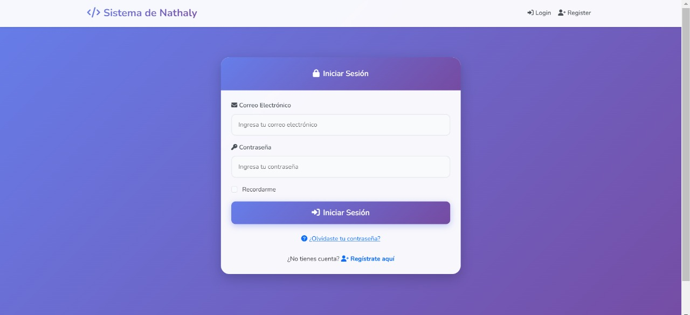
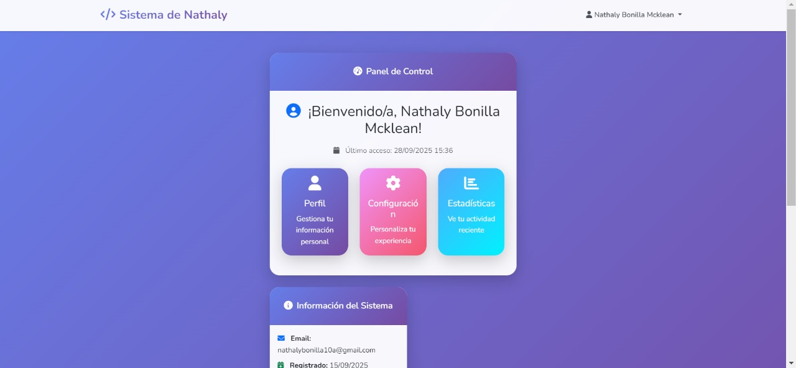
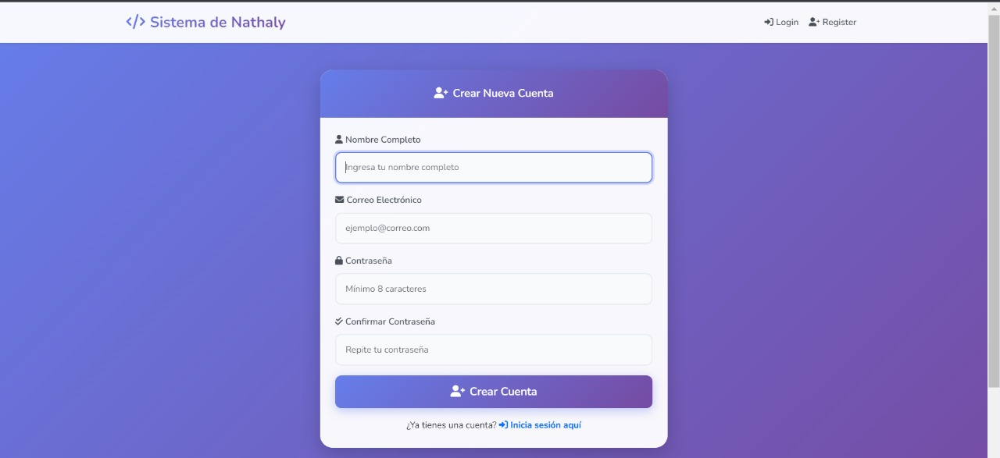
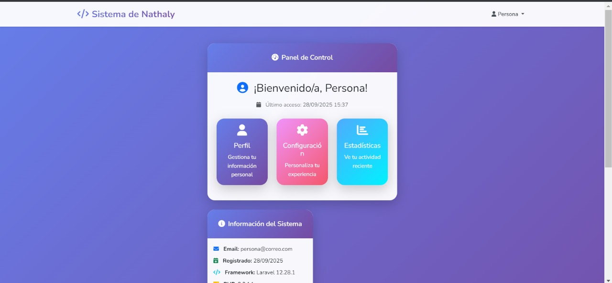

# Laboratorio #2 - Implementación del Login en Laravel

## Contenido
- [Requisitos Previos](#requisitos-previos)
- [Introducción](#introducción)
- [Comandos Utilizados](#comandos-utilizados)
- [Resultado del Laboratorio](#resultado-del-laboratorio)
- [Capturas de pantalla](#capturas-de-pantalla)
- [Base de Datos](#base-de-datos)
- [Dificultades Encontradas y Soluciones](#dificultades-encontradas-y-soluciones)
- [Referencias Bibliográficas](#referencias-bibliográficas)
- [Información de la Desarrolladora](#información-de-la-desarrolladora)


<p align="center">
  
  
  
</p>

## Requisitos Previos

### Prerrequisitos (Ecosistema de desarrollo)
-  **PHP** versión 8.0 o superior
-  **Composer** última versión estable
-  **Laravel** Framework
-  **WampServer** (Entorno de Desarrollo)
-  **Servidor web**: Apache
-  **Base de datos**: MySQL/MariaDB
-  **Editor de código**: Visual Studio Code
-  **NPM**: Para compilación de assets
-  **Sistema Operativo**: Windows

## Introducción

Laravel es un framework de desarrollo web basado en el patrón **Modelo-Vista-Controlador (MVC)**, que separa la lógica de la aplicación en tres capas principales:

### Arquitectura MVC en Laravel:
- **Modelos** (`app/Models`): Representan la estructura de datos y lógica de negocio
- **Vistas** (`resources/views`): Interfaz de usuario y presentación
- **Controladores** (`app/Http/Controllers`): Lógica de control entre modelos y vistas
- **Rutas** (`routes/`): Definición de URLs y endpoints de la aplicación

### Objetivo del Laboratorio
Implementar un sistema de autenticación básico (login y registro de usuarios) utilizando Laravel, comprendiendo la estructura MVC y configurando el entorno de desarrollo completo.

## Comandos Utilizados

### Instalación del Proyecto
```bash
# Crear proyecto Laravel
composer create-project laravel/laravel login-mvc

# Navegar al directorio
cd login-mvc
```

### Configuración de la Base de Datos
```bash
# Limpiar configuración
php artisan config:clear
php artisan config:cache

# Ejecutar migraciones
php artisan migrate
```

### Instalación de Autenticación
```bash
# Instalar Laravel UI
composer require laravel/ui

# Generar scaffolding de autenticación con Bootstrap
php artisan ui bootstrap --auth

# Instalar dependencias frontend y compilar
npm install && npm run dev
```

### Ejecución del Servidor
```bash
# Iniciar servidor de desarrollo
php artisan serve
```

## Resultado del Laboratorio

El laboratorio resultó en una aplicación web funcional con sistema de autenticación completo, incluyendo:

- Página principal
- Formulario de registro de usuarios
- Formulario de login
- Dashboard de usuario autenticado
- Funcionalidad de logout

## Capturas de pantalla
   ### Formulario de Login
   

   ### Panel de control de Login
   
   
   ### Formulario de Registro
   

   ### Panel de control de register
   
   
   

## Base de Datos

### Configuración del archivo .env
```env
DB_CONNECTION=mysql
DB_HOST=127.0.0.1
DB_PORT=3306
DB_DATABASE=login_mvc
DB_USERNAME=root
DB_PASSWORD=
```

### Migraciones Ejecutadas
- `users` - Tabla de usuarios con campos: name, email, password, timestamps
- `password_reset_tokens` - Para recuperación de contraseñas
- `failed_jobs` - Registro de trabajos fallidos

*Nota: El backup de la base de datos se encuentra en el directorio `/database/backup/`*

## Dificultades Encontradas y Soluciones

### Problema 1: PHP no reconocido en consola
**Descripción**: El comando PHP no era reconocido en la línea de comandos de Windows.

**Solución**: Creación de un archivo `.cmd` para cargar PHP en el PATH del sistema.

```cmd
@echo off
set PATH=%PATH%;C:\wamp64\bin\php\php8.1.10
cmd
```

## Referencias Bibliográficas

1. **Laravel Documentation**. (2025). *Laravel Framework Documentation*. Recuperado de: https://laravel.com/docs
2. **Composer**. (2025). *Dependency Manager for PHP*. Recuperado de: https://getcomposer.org/doc/
3. **Node.js**. (2025). *Node.js Runtime Documentation*. Recuperado de: https://nodejs.org/en/docs

## Información de la Desarrolladora

---

**Este laboratorio ha sido desarrollado por la estudiante de la Universidad Tecnológica de Panamá:**

- **Nombre**: Nathaly Bonilla Mcklean
- **Correo**:
    - **Institucional**: nathaly.bonilla1@utp.ac.pa 
    - **Github**: githubmcklean@gmail.com
    - **Profesional**: nbmcklean@gmail.com
- **Curso**: Ingeniería Web
- **Instructora del Laboratorio**: Ing. Irina Fong
- **Fecha de Ejecución**: 8 - 14 de septiembre de 2025
- **Última modificación**: 28 de septiembre de 2025
- **Fecha de Entrega**: 29 de septiembre de 2025


---

<p align="center">
  <strong>Universidad Tecnológica de Panamá</strong><br>
  Facultad de Ingeniería de Sistemas Computacionales<br>
  Licenciatura en Ingeniería de Software<br>
  II Semestre 2025
</p>